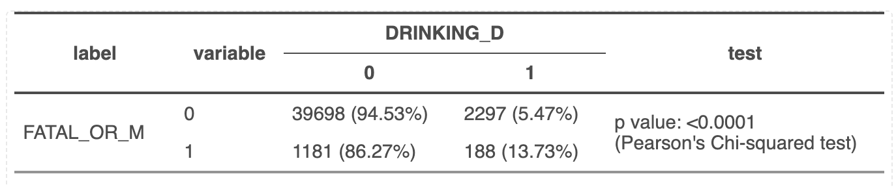
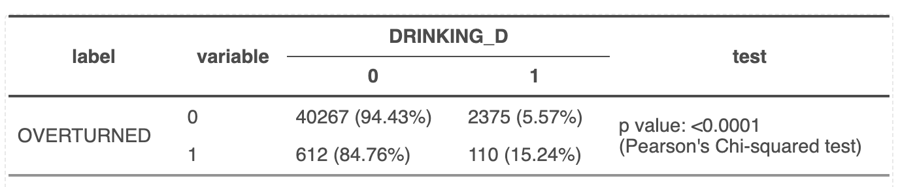
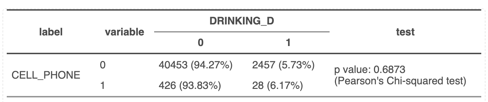
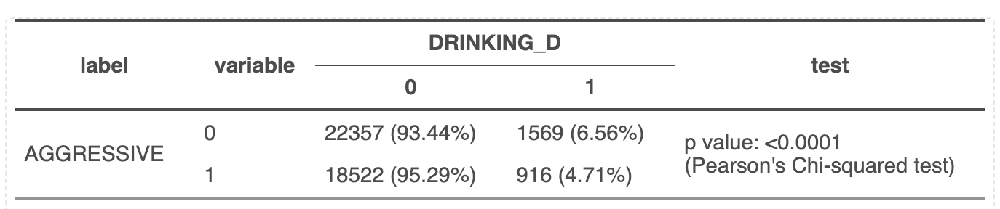
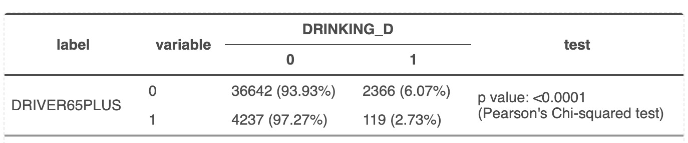

# Homework 3: The Application of Logistic Regression to Examine the Predictors of Car Crashes Caused by Alcohol

## 1 Introduction

### 1.1 Project Background

According to the US Department of Transportation, almost 30 people a day -- or
approximately one person every 51 minutes -- die in motor vehicle crashes that
involve an alcohol-impaired driver. Many more individuals are injured in these
crashes. A recent study conducted by the National Highway Traffic Safety
Administration has shown that the economic impact of alcohol-related crashes is
estimated to be more than \$59 billion annually.

The goal of the current assignment is to identify predictors of accidents
related to drunk driving. The data used in this assignment come from a data set
containing all 53,260 car crashes in the City of Philadelphia for the years 2008
-- 2012. The data set was compiled by the Pennsylvania Department of
Transportation, and is made available to the public at OpenDataPhilly.org.

Because the crash data is geocoded, it is possible to spatially join the data to
the 2000 Census block group level data set that was used for our two previous
homework assignments. After the spatial join, each crash point contains the
median household income and the percent of individuals with at least a
bachelor\'s degree in the block group where the crash took place.

Even though the original data set has a total of 53,260 car crashes, for the
sake of this assignment, we remove the 9,896 crash locations which took place in
non-residential block groups, where median household income and vacancy rates
are 0, from the data set. The final data set contains the 43,364 crashes that
took place in Philadelphia\'s residential block groups.

Here, we will be regressing the binary dependent variable, DRINKING_D, on the
following binary and continuous predictors: FATAL_OR_M: Crash resulted in
fatality or major injury (1 = Yes, 0 = No), OVERTURNED: Crash involved an
overturned vehicle (1 = Yes, 0 = No), CELL_PHONE: Driver was using cell phone
(1= Yes, 0 = No), SPEEDING: Crash involved speeding car (1 = Yes, 0 = No),
AGGRESSIVE: Crash involved aggressive driving (1 = Yes, 0 = No), DRIVER1617:
Crash involved at least one driver who was 16 or 17 years old (1 = Yes, 0 = No),
DRIVER65PLUS: Crash involved at least one driver who was at least 65 years old
(1 = Yes, 0 = No), PCTBACHMOR: Percentage of individuals 25 years of age or
older who have at least a bachelor\'s degree in the Census Block Group where the
crash took place, and MEDHHINC: Median household income in the Census Block
Group where the crash took place.

### 1.2 Reasoning of Predictors

The reasons why we think the predictors we\'re using might be associated with
the response variable are the following.

Crash involved an overturned vehicle: When a vehicle overturns, there is an
increased risk of occupants being ejected from the vehicle. If the vehicle's
windows or doors are damaged during the crash, the occupants will be highly
likely ejected. Ejection will increase the likelihood of severe injury or
fatality. In addition, in an overturn, airbags may not be functioning, which
adds another level of risk to the occupants. Also, in the event of an overturn,
occupants may find it challenging to exit the vehicle quickly, especially if the
doors are damaged or blocked, which can lead to increased injuries if they are
not rescued in time.

Driver was using cell phone: Driving while using a cell phone is a distraction
for drivers, this distraction can lead to an increased likelihood of accidents.
In one study, the researchers found \"Close to half of the instances of
distraction that participants (of the study) generated referred to mobile phone
use\" (Rolison, Regev, Moutari,Feeney, 2018). The distraction of cell phone use
can increase reaction time, drivers may not be able to notice dangers on the
road and lead to fatal accidents.

Crash involved speeding car: A driver traveling at a higher speed may not have
enough time to brake to avoid a collision. According to the US Department of
Transportation, More than 12,000 people were killed in speed-related crashes in
2021. 

Crash involved aggressive driving: According to the US Department of
Transportation, for more than two decades, speeding has been involved in
approximately one-third of all motor vehicle fatalities. In 2021, speeding was a
contributing factor in 29% of all traffic fatalities. Aggressive drivers often
switch lanes a lot, make sudden lane changes, and forget to use their turn
signals, which leads to traffic accidents.

Crash involved at least one driver who was 16 or 17 years old: Among teenage
drivers, crash rates were highest for 16 year-olds --- 26 crashes per million
miles traveled compared with 21, 15, and 14 per million for 17, 18, and 19
year-olds, respectively (Insurance Institute for Highway Safety [IIHS], 2006a)
In addition, young drivers may have higher chance of having dangerous driving
habits. Police officers and the driving public frequently generated examples of
\"dangerous driving (peer pressure, showing off)\" for scenarios involving young
drivers, especially male drivers\" (Rolison, Regev, Moutari,Feeney, 2018).

Crash involved at least one driver who was at least 65 years old: According to
Centers for Disease Control and Prevention, in 2020, about 7,500 older adults
were killed in traffic crashes, and almost 200,000 were treated in emergency
departments for crash injuries. This means that each day, 20 older adults are
killed and almost 540 are injured in crashes.

Percentage of individuals 25 years of age or older who have at least a
bachelor\'s degree in the Census Block Group where the crash took place: Higher
education levels may be associated with better driving habits. In addition,
college-level education may bring these individuals with higher risk awareness.
Therefore, there may be fewer fatal accidents associated with college-educated
drivers.

Median household income in the Census Block Group where the crash took place:
Higher socio-economic status could be associated with safer driving conditions
and access to safer vehicles. Therefore, it can also impact the likelihood of
crashes and the amount of fatal cases.

### 1.3 Tool

We\'ll be using R to run logistic regression for the analysis.

## 2 Methodology

### 2.1 Problems with Using OLS Regression

OLS (Ordinary Least Squares) regression is a statistical method used to examine
the relationship between a variable of interest (dependent variable) and one or
more explanatory variables (predictors). In the OLS formula below, $β_1$ is
interpreted as the amount by which the dependent variable Y changes when $x_1$
increases by 1 unit.

$$
Y = \beta_0 + \beta_1 x_1 + \varepsilon 
$$

However, in our situation, assume Y is a binary variable representing the crash
resulted in fatality or major injury, with 1=there\'s a crash resulted in
fatality or major injury, 0=there\'s no crash resulted in fatality or major
injury. The dependent variable (Crash resulted in fatality or major injury) is
either 0 or 1. So saying that a 1 unit increase in $x_1$ results in a $β_1$
(Driver was using cell phone, for example) increase in Y(Crash resulted in
fatality or major injury) makes no sense, as Y(Crash resulted in fatality or
major injury) can change only from 0 to 1 or from 1 to 0.

### 2.2 Logistic Regression

#### 2.2.1 Odds

Before diving into logistic regression, we should review the concept of odds
first.

Different from probability that may be calculated as (\# desirable outcomes)/(\#
possible outcomes), odds may be calculated as (\# desirable outcomes)/(\#
undesirable outcomes). In other words, odds represent the chance of an event
happening versus the event not happening.

The odds ratio compares the odds of an event happening in one group to the odds
of it happening in another group. If the odds ratio is 1, it suggests that the
odds of the event occurring are the same in both groups. An odd ratio greater
than 1 indicates that the event is more likely in one group, while an odd ratio
less than 1 suggests that the event is more likely in the other group.

#### 2.2.2 Regression Equation for the Logit Model

The logit model with one predictor looks like the following:

$$
\ln\left(\frac{p}{1-p}\right) = \beta_0 + \beta_1 x_1 + \varepsilon
$$

In the equation above, p=P(Y=1). The quantity $O = \frac{p}{1 - p}$ is called
the odds. The quantity $\ln\left(\frac{p}{1-p}\right)$ is called the log odds,
or logit. 

If we solve the equation above for p = P(Y=1), a little algebra later, we will
get:

$$
P = \frac{e^{\beta_0 + \beta_1 x_1}}{1 + e^{\beta_0 + \beta_1 x_1}} = \frac{1}{1 + e^{-\beta_0 - \beta_1 x_1}}
$$

The function above is for the logistic function with a single predictor,
although some statisticians will still call it just the logit function. P
represents the probability of the dependent variable with the value of 1. e is
the base of the natural logarithm. β0 represents the log odds of the event
occurring when all predictors are zero. $β_1$ is the coefficient associated with
the predictor $x_1$, which represents the change of the event for a one-unit
change in $x_1$. $x_1$ is the value of the predictor in the logistic regression
equation. If $\hatβ_0+\hatβ_1 x_1 = 0$, then p=0.5. As $\hatβ_0+\hatβ_1 x_1$
gets really big, p approaches 1. As $\hatβ_0+\hatβ_1 x_1$ gets really small, p
approaches 0.

Then, for multivariate logistic regression with n predictors, that equation
becomes

$$
 p = \frac{e^{\beta_0 + \beta_1 x_1 + \beta_2 x_2 + \beta_3 x_3}}{1 + e^{\beta_0 + \beta_1 x_1 + \beta_2 x_2 + \beta_3 x_3}}
$$

In our case, the formula will be

$$
 p_{\text{FATAL\_OR\_M}} = \frac{e^{\beta_0 + \beta_1 \text{OVERTURNED} + \beta_2 \text{CELL\_PHONE} + \beta_3 \text{SPEEDING} + \beta_4 \text{AGGRESSIVE} + \beta_5 \text{DRIVER1617} + \beta_6 \text{DRIVER65PLUS} + \beta_7 \text{PCTBACHMOR} + \beta_8 \text{MEDHHINC}}}{1 + e^{\beta_0 + \beta_1 \text{OVERTURNED} + \beta_2 \text{CELL\_PHONE} + \beta_3 \text{SPEEDING} + \beta_4 \text{AGGRESSIVE} + \beta_5 \text{DRIVER1617} + \beta_6 \text{DRIVER65PLUS} + \beta_7 \text{PCTBACHMOR} + \beta_8 \text{MEDHHINC}} }
$$

The logistic function works well for models where the dependent variable is
binary. Since the logistic function always has outputs between 0 and 1, it will
be best used in answering questions/measuring variables of yes or no. In
addition, since the output of the logistic function will approaches 0 as when
the predictors $x_k$ approaches -∞ and the logistic function will approaches 1
as when the predictors $x_k$ approaches +∞, it can ensure the values of
predictors not affect the final output stay inside the range of 0 to 1.

### 2.3 Hypothesis

Here, we are doing the following hypothesis test for each predictor $X_𝑖$:

-   $𝐻_0: 𝛽_𝑖=0$ The null hypothesis ($𝐻_0$​) is that the predictor $X_i$​ has no
    effect on the probability of the dependent event occurring.

-   $𝐻_𝑎: 𝛽_𝑖≠0$ The alternative hypothesis ($𝐻_a$​) posits that the predictor
    $X_i$​​ does have an effect on the probability of the dependent event
    occurring.

The test statistic used to evaluate these hypotheses is called Wald statistic
within the context of logistic regression. It is given by the formula
$W = \hatβ̂_i / \sigma_{\hatβ̂_i}$ and has a normal distribution, where $\hatβ̂_i$
is the estimated coefficient for the ith predictor and $\sigma_{\hatβ̂_i}$ is the
variance of the estimated coefficient.

Rather than looking at the estimated 𝛽 coefficients, most statisticians prefer
to look at odds ratios, which are calculated by exponentiating the coefficients
$OR_i=e^{\hatβ_​i}$. Therefore, the hypothesis can also be written as
$𝐻_0: 𝑂𝑅_𝑖=1$ and $𝐻_𝑎:𝑂𝑅_𝑖≠1$.

### 2.4 Assessing the quality of model fit

The quality of the logistic regression model fit is not well described by $R^2$
as in OLS. $R^2$ in OLS regression is a direct measure of variance explained, in
logistic regression it is a more abstract concept that requires careful
interpretation and is often replaced by other measures of model fit.

**Akaike Information Criterion** (AIC) is a measure for comparing the relative
quality of statistical models for a given dataset, penalizing complexity to
favor models that achieve a good fit with fewer parameters. A lower AIC
indicates a model with a better balance between simplicity and fit.

-   **Sensitivity**: The proportion of true positives correctly identified, with
    higher values indicating better model performance.

-   **Specificity**: The proportion of true negatives correctly identified, with
    higher values also being preferable.

-   **Misclassification Rate**: The proportion of incorrect predictions, where a
    lower rate signifies a more accurate model.

The fitted values in logistic regression, $\hat y$ are the predicted
probabilities that the outcome variable equals one. These probabilities are
calculated using the logistic function, and a cut-off value is chosen to
classify these probabilities into binary outcomes. Different cut-offs for the
probability are considered to balance sensitivity and specificity, which can
vary depending on the context and the costs associated with false positives and
false negatives. Adjusting the cut-off can optimize the model for either recall
or precision, depending on which is more critical for the given application.

The **Receiver Operating Characteristic** (ROC) curve plots the true positive
rate (sensitivity) against the false positive rate (1-specificity) at various
threshold settings, providing a visual representation of a classifier's
performance across all possible cut-offs. A couple different ways for
identifying the probability cut-offs based on ROC Curves:

-   Youden Index: A cut-off for which (Sensitivity + Specificity) is maximized

-   A cut-off for which the ROC curve has the minimum distance from the upper
    left corner of the graph -- i.e., the point at which specificity = 1 and
    sensitivity = 1. In this report, we will be utilizing this method to
    determine the cut-off.

{width="401"}

The **Area Under the ROC Curve** (AUC) is a summary measure that represents a
model's ability to discriminate between positive and negative classes. The AUC
ranges from 0 to 1, with higher values indicating better model performance. A
typical classification scheme is:

-   Excellent: AUC \> 0.9

-   Good: AUC between 0.8 and 0.9

-   Fair: AUC between 0.7 and 0.8

-   Poor: AUC between 0.6 and 0.7

-   Fail: AUC \< 0.6

In essence, these metrics provide a comprehensive view of the model's predictive
accuracy and are essential for both model evaluation and decision-making
processes.

### 2.5 Assumptions of Logistic Regression

Comparing assumptions with OLS:

**Shared Assumptions:**

-   **Independence of observations:** Both OLS and logistic regression require
    that observations be independent of one another.

-   **No severe multicollinearity:** Both types of regression assume that
    predictors are not perfectly collinear; however, logistic regression is
    generally more tolerant of multicollinearity.

**Distinct Assumptions of Logistic Regression:**

-   **Binary Dependent Variable (DV):** The dependent variable in logistic
    regression must be binary.

-   **Larger sample Size:** Logistic regression typically requires a larger
    sample size due to the use of Maximum Likelihood Estimation (MLE) rather
    than least squares for estimating regression coefficients. A rule of thumb
    is at least 50 observations per predictor, compared to about 10 per
    predictor in OLS regression.

**Assumptions Not Required for Logistic Regression:**

-   **Linearity:** There is no requirement for a linear relationship between the
    DV and the independent variables (IVs). Instead, logistic regression assumes
    linearity between the log odds of the DV and each IV.

-   **Homoscedasticity and Normality of Residuals:** Unlike OLS, logistic
    regression does not assume that residuals are normally distributed or that
    the variance of error terms is constant across all levels of the IVs.

### 2.6 Exploratory Analyses

Before performing logistic regression, statisticians often engage in exploratory
analyses to investigate the structure and relationships within the data.

#### 2.6.1 Cross-Tabulations & Chi-Square Test

Cross-tabulations are utilized to examine the relationship between the binary
dependent variable `DRIVING_D` and each binary predictor (`FATAL_OR_M`,
`OVERTURNED`, `CELL_PHONE`, `SPEEDING`, `AGGRESSIVE`, `DRIVER1617`,
`DRIVER65PLUS`). The Chi-Square test is the appropriate statistical test for
assessing the association between two categorical variables. The Chi-Square
distribution is the sum of squares of $k$ independent standard normal random
variables, where $k$ is the degrees of freedom. Degrees of freedom can be
calculated as $(R-1)(C-1)$ where $C$ is the number of categories in one of the
variables and $R$ is the number of categories in the other variable. The
hypotheses are:

-   $H_0$ : the proportion across the variable categories for crashes that
    involve drunk drivers is the same as for crashes that don't involve drunk
    drivers.

-   $H_a$ : the proportion across the variable categories for crashes that
    involve drunk drivers is different than for crashes that don't involve drunk
    drivers.

#### 2.6.2 Comparing Means of Continuous Predictors

For continuous predictors (`PCTBACHMR`, `MEDHHINC`), we can compare the means
across the different values of the dependent variable. This is typically done
using independent samples t-tests. For example, we can see whether the average
`PCTBACHMOR` values are statistically significantly different for crashes that
involve drunk drivers and crashes that don't. The null and alternative
hypotheses for the independent samples t-test would be as follows:

-   $H_0$ : average values of the variable `PCTBACHMOR` are the same for crashes
    that involve drunk drivers and crashes that don't.

-   $H_a$ : average values of the variable `PCTBACHMOR` are different for
    crashes that involve drunk drivers and crashes that don't.

## 3 Results

```{r setup, include=FALSE, warning=FALSE, message=FALSE}
knitr::opts_chunk$set(echo = TRUE)
library(tidyverse)
library(sf)
library(janitor)
#library(ggthemr)
library(ggpubr)
library(ggrepel)
library(purrr)
library(kableExtra)
library(caret)
library(corrplot)
library(prediction)
options(scipen = 999) # turn off scientific notation
library(aod)
#library(rms)
library(gmodels)
library(ROCR)
library(kableExtra)
library(crosstable)
library(flextable)
library(ggplot2)
library(readr)
library(sjPlot)
```

### 3.1 Exploratory Analyses

The following is the tabulation of the dependent variable `DRINKING_D`, showing
2485 crashes that involves drunk driving, taking up 5.7% of all crashes.

```{r message=FALSE, warning=FALSE}
crash_data <- read_csv("Logistic Regression Data.csv")

table_result <- table(factor(crash_data$DRINKING_D, levels = c(0, 1), labels = c("No Alcohol Involved", "Alcohol Involved")))


result_df <- as.data.frame(table_result)
result_df$Proportion <- prop.table(table_result)
colnames(result_df) <- c("Alcoho-related", "Count", "Proportion")

#print(result_df)
#kable(result_df)
result_df %>%
  kbl() %>%
    kable_styling() %>%
    kable_classic(html_font = "Cambria", position = "left", full_width = F)

```

To assess the significance of the association between the dependent variable and
each of the binary predictors, we can look at the results of the Chi-Square
tests. The Chi-Square test's null hypothesis is that there is no association
between the variables.

Looking at the p-value, all of the variables except for `CELL_PHONE` have small
p-value, less than 0.05, suggests that we can reject the null hypothesis.
`CELL_PHONE` has a larger p-value of 0.6873, indicating that there is not enough
evidence to reject the null hypothesis.

```{r result='hide', warning=FALSE, message=FALSE}
variables <- c("FATAL_OR_M", "OVERTURNED", "CELL_PHONE", "SPEEDING", "AGGRESSIVE", "DRIVER1617", "DRIVER65PLUS")

create_and_print_table <- function(variable) {
  crosstable(crash_data, !!as.name(variable), by = "DRINKING_D", funs = "mean", test = TRUE) %>% 
    as_flextable() 
}

tables <- map(variables, create_and_print_table)
# tables
```







](images/Screen Shot 2023-11-27 at 11.06.04 PM.png)

](images/Screen Shot 2023-11-27 at 11.06.13 PM.png)

The following table is summary table of means, standard Deviations, and T-Test
results. In both cases, the p-values are greater than the conventional
significance level of 0.05, with p-values of 0.9 for `PCTBACHMOR` and 0.16 for
`MEDHHINC`. This suggests that we fail to reject the null hypothesis, indicating
that there is no significant difference in the means of `PCTBACHMOR` and
`MEDHHINC` between the groups of non-drunk and drunk driving.

```{r}
group1 <- crash_data[crash_data$DRINKING_D == 0, ]
group2 <- crash_data[crash_data$DRINKING_D == 1, ]

mean_group1_var1 <- mean(group1[['PCTBACHMOR']])
mean_group1_var2 <- mean(group1[['MEDHHINC']])
mean_group2_var1 <- mean(group2[['PCTBACHMOR']])
mean_group2_var2 <- mean(group2[['MEDHHINC']])
sd_group1_var1 <- sd(group1[['PCTBACHMOR']])
sd_group1_var2 <- sd(group1[['MEDHHINC']])
sd_group2_var1 <- sd(group2[['PCTBACHMOR']])
sd_group2_var2 <- sd(group2[['MEDHHINC']])

# Perform t-tests for both predictors
t_test_result_var1 <- t.test(group1[['PCTBACHMOR']], group2[['PCTBACHMOR']])
t_test_result_var2 <- t.test(group1[['MEDHHINC']], group2[['MEDHHINC']])

# Create a summary data frame
summary_df <- data.frame(
  Variable = c("PCTBACHMOR", "MEDHHINC"),
  Non_drunk_Mean = c(mean_group1_var1, mean_group1_var2),
  Non_drunk_SD = c(sd_group1_var1, sd_group1_var2),
  Drunk_Mean = c(mean_group2_var1, mean_group2_var2),
  Drunk_SD = c(sd_group2_var1, sd_group2_var2),
  P_Value_PCTBACHMOR = t_test_result_var1$p.value,
  P_Value_MEDHHINC = t_test_result_var2$p.value
)

# Print the summary table
#print(summary_df)

summary_df %>%
  kbl(caption = "Summary Table of Means, Standard Deviations, and T-Test Results") %>%
    kable_styling() %>%
    kable_classic(html_font = "Cambria", position = "left", full_width = F)
```

### 3.2 Logistic Regression Assumptions

Pearson correlation assumes a linear relationship and are designed for
continuous variables. In our case, binary variables have limited variability,
and their relationship might not be well captured by linear correlation. There
might be nonlinear associations that Pearson correlation cannot detect. Due to
the limitation of binary variables (0 or 1), the correlation coefficient might
not fully capture the strength and nature of associations.

Multicollinearity occurs when predictors are highly correlated, which can cause
issues with estimating the individual coefficients' effects. There is no
correlation coefficients close to 1 or -1 in the following correlation matrix,
indicating there's no strong linear relationships.

(If there is, we need to calculate Variance Inflation Factors (VIF) for each
predictor to quantify the extent of multicollinearity. VIF values above 10 or 5
are often considered problematic.)

```{r}
correlation <- crash_data[c(4:10, 12:13)]
#cor(correlation, method = "pearson")
```

The highest correlation between median household income `MEDHHINC` and percent
of bachelor's degree `PCTBACHMOR` with a correlation score of 0.48.
Additionally, the second-highest correlation between speeding `SPEEDING` and
aggressive driving `AGGRESSIVE` with a correlation score of 0.21.

A positive correlation of 0.48 and 0.21 indicates a moderate, positive linear
relationship between the variables. For example, as median household income
increases, there is a tendency for the percentage of people with a bachelor's
degree to also increase. These correlation is not extremely strong but suggests
a noticeable trend.

```{r, warning=FALSE, message=FALSE}
library(corrr)

correlation %>% 
  correlate() %>% 
  autoplot() +
  geom_text(aes(label = round(r, digits=2)), size =3) +
  labs(title = "Correlation Matrix")
```

### 3.3 Logistic Regression Results

In this Logistic Regression, `FATAL_OR_M`, `OVERTURNED`, `SPEEDING`,
`AGGRESSIVE`, `DRIVER1617`, and `DRIVER65PLUS` are significant predictors of
`DRINKING_D` presence. We can say that a 1 unit increase in the predictor
corresponds to a$ (𝑒^{𝛽_1}−1)∗100% $change in the odds of Y=1, holding the
values of the other predictors constant. The `CELL_PHONE`, `PCTBACHMOR`,
`MEDHHINC` are not significant predictors.

```{r}
logistic <- glm(DRINKING_D ~ FATAL_OR_M + OVERTURNED + CELL_PHONE +
                        SPEEDING + AGGRESSIVE + DRIVER1617 + DRIVER65PLUS +
                        PCTBACHMOR + MEDHHINC, family = "binomial", data = crash_data)

# Display summary
summary(logistic)

```

```{r}
logitoutput <- summary(logistic)
logitcoeffs <- logitoutput$coefficient
```

The odds ratio is associated with the change in the odds of the dependent
variable given a one-unit change in the predictor variable. An odds ratio of 1
suggests no association or no effect, which means that the odds of the event
occurring are the same in both groups.

`PCTBACHMOR`, `CELL_PHONE` and `MEDHHINC` have ORs near 1, which means no effect
to the dependent variable, and the CIs of `PCTBACHMOR` and `CELL_PHONE` include
1, it suggests that the OR is not statistically significantly different from 1
(no effect). Although CI of `MEDHHINC` does not include 1, it's still near to 1
and we suggest that it is not statistically significantly different from 1 as
well.

```{r}
or_ci <- exp(cbind(OR = coef(logistic), confint(logistic)))

finallogitoutput <- cbind(logitcoeffs, or_ci)
finallogitoutput
```

The lowest cut-off is at 0.02. Lowering the cut-off increases sensitivity but
decrease specificity, which means the model is more likely to classify positive
cases correctly but might also classify more negatives as positives.

The highest cut-off is at 0.5. Raising the cut-off increases specificity but
decrease sensitivity, which means the model is more conservative in classifying
instances as positive, resulting in fewer false positives but potentially more
false negatives.

```{r}
cut_off_values <- c(0.02, 0.03, 0.05, 0.07, 0.08, 0.09, 0.1, 0.15, 0.2, 0.5)

result_df <- data.frame(
  Cut_off_Value = cut_off_values,
  Sensitivity = numeric(length(cut_off_values)),
  Specificity = numeric(length(cut_off_values)),
  Misclassification_Rate = numeric(length(cut_off_values))
)

fit <- predict(logistic, type = "response")

# Loop through each cut-off value and calculate metrics
for (i in seq_along(cut_off_values)) {
  fit.binary <- as.integer(fit >= cut_off_values[i])
  table_result <- table(fit.binary, crash_data$DRINKING_D)
  
  # Check if both classes are present in the data
  if (sum(table_result[1, ]) > 0 && sum(table_result[2, ]) > 0) {
    sensitivity <- table_result[2, 2] / sum(table_result[2, ])
    specificity <- table_result[1, 1] / sum(table_result[1, ])
    misclassification_rate <- sum(table_result[1, 2], table_result[2, 1]) / sum(table_result)
    result_df[i, c("Sensitivity", "Specificity", "Misclassification_Rate")] <- c(sensitivity, specificity, misclassification_rate)
  } else {
    warning(paste("One or both classes missing for cut-off value:", cut_off_values[i]))
  }
}


result_df %>%
  kbl(caption = "Summary Table of Means, Standard Deviations, and T-Test Results") %>%
    kable_styling() %>%
    kable_classic(html_font = "Cambria", position = "left", full_width = F)
```

```{r}
a <- cbind(crash_data$DRINKING_D, fit)
colnames(a) <- c("labels", "predictions")
head(a)
```

The ROC curve illustrates the trade-off between sensitivity and specificity
across different cut-off values. A curve that approaches the upper-left corner
indicates better overall model performance.

```{r}
roc <- as.data.frame(a)
pred <- ROCR::prediction(roc$predictions, roc$labels)
roc.perf = performance(pred, measure = "tpr", x.measure = "fpr")
plot(roc.perf)
abline(a = 0, b = 1)
```

The optimal cut-off in 3.c.ii was identified based on minimizing the
misclassification rate. The code below yields the cut-off value for which the
ROC curve has the minimum distance from the upper left corner of the graph,
where specificity = 1 and sensitivity = 1. The cut-off that minimizes the
misclassification rate may differ from the one that optimizes the ROC curve. The
choice depends on the specific goals and priorities of your analysis.

This prints the optimal cut-off point is 0.06365151 and the corresponding
specificity and sensitivity. It seems that there exists a cut-off at which we
can achieve fine sensitivity and specificity

```{r}
opt.cut = function(perf, pred){
  cut.ind = mapply(FUN=function(x, y, p){
    d = (x - 0)^2 + (y-1)^2
    ind = which(d == min(d))
    c(sensitivity = y[[ind]], specificity = 1-x[[ind]], 
      cutoff = p[[ind]])
  }, perf@x.values, perf@y.values, pred@cutoffs)
}

print(opt.cut(roc.perf, pred))
```

The area under the ROC curve is 0.6398695, indicating poor accuracy. Therefore,
we will exclude the non significant variables to see if it has a better accuracy
for prediction.

```{r}
auc.perf = performance(pred, measure ="auc")
auc.perf@y.values

```

In the second regression with the binary predictors only, without `PCTBACHMOR`
and `MEDHHINC`, other than `CELL_PHONE`, all variables are significant.

```{r}
logistic2 <- glm(DRINKING_D ~ FATAL_OR_M + OVERTURNED + CELL_PHONE +
                        SPEEDING + AGGRESSIVE + DRIVER1617 + DRIVER65PLUS, family = "binomial", data = crash_data)

# Display summary
summary(logistic2)

```

```{r}
logitoutput <- summary(logistic2)
logitcoeffs <- logitoutput$coefficients
```

`CELL_PHONE`has OR near 1, which means no effect to the dependent variable, and
the CIs of `CELL_PHONE` includes 1, it suggests that the OR is not statistically
significantly different from 1 (no effect).

```{r}
or_ci <- exp(cbind(OR = coef(logistic2), confint(logistic2)))

finallogitoutput <- cbind(logitcoeffs, or_ci)
finallogitoutput
```

AIC is a measure of the goodness of fit of a model, balancing model complexity
and fit. Lower AIC values indicate a better trade-off. The original logistic
regression has a lower AIC compared to the binary models, suggesting it provides
a better fit to the data.

```{r}
AIC(logistic, logistic2) %>%
  kbl(caption = "AIC") %>%
  kable_styling() %>%
  kable_classic(html_font = "Cambria", position = "left", full_width = F)
```

## 4 Discussion

**a)** Recap of Findings: **i.** The analysis aimed to assess the association
between various predictors and crashes involving drunk driving (`DRINKING_D`).
`FATAL_OR_M`, `OVERTURNED`, `SPEEDING`, `AGGRESSIVE`, `DRIVER1617`, and
`DRIVER65PLUS` were identified as significant predictors, while `CELL_PHONE`,
`PCTBACHMOR`, and `MEDHHINC` did not show significant associations. **ii.** The
results align with expectations for significant predictors, with variables
related to crash severity and risky driving behaviors showing significance. The
lack of significance for `PCTBACHMOR` and `MEDHHINC` may be due to continuous
characteristics where as all the other variables are binary. Surprisingly,
`CELL_PHONE` is not significant, which we assume that driver using cell phone
may be highly related to drunk driving. **iii.** Logistic regression is
appropriate for binary outcomes, such as `DRINKING_D`. However, considering the
low prevalence of crashes involving drunk driving (5.7% of cases), the problem
is not specifically the rarity of events, but rather the possibility of a small
number of cases on the rarer of the two outcomes. Rare events methods, as
proposed by Paul Allison, might enhance the modeling of rare events.

**b)** Limitations: **i** The low percentage (5.7%) of crashes involving drunk
driving may lead to challenges in modeling rare events. The dataset's imbalance
could impact the generalizability of the findings to the broader population.
**ii** The analysis assumes a linear relationship between predictors and the
log-odds of the dependent variable. Nonlinear relationships or interactions
between variables may not be fully captured, impacting the model's accuracy.
**iii** The analysis focused on specific predictors, and there might be other
relevant variables not included in the model. **iiii** While the correlation
matrix suggested no severe multicollinearity, additional diagnostics, such as
Variance Inflation Factors (VIF), could provide a more detailed assessment.

## 5 Citation

Jonathan J. Rolison, Shirley Regev, Salissou Moutari, Aidan Feeney, What are the
factors that contribute to road accidents? An assessment of law enforcement
views, ordinary drivers\' opinions, and road accident records, Accident Analysis
& Prevention, Volume 115, 2018, Pages 11-24,ISSN 0001-4575,
<https://doi.org/10.1016/j.aap.2018.02.025>.

Keli A. Braitman, Bevan B. Kirley, Anne T. McCartt, Neil K. Chaudhary, Crashes
of novice teenage drivers: Characteristics and contributing factors, Journal of
Safety Research,Volume 39, Issue 1,2008, Pages 47-54, ISSN 0022-4375,
<https://doi.org/10.1016/j.jsr.2007.12.002.>

Older adult driver safety. (2022, June 28). Centers for Disease Control and
Prevention.
<https://www.cdc.gov/transportationsafety/older_adult_drivers/index.html>

Speeding catches up with you. NHTSA. (n.d.).
<https://www.nhtsa.gov/campaign/speeding-catches-up-with-you> 

Speeding \| NHTSA. (n.d.). NHTSA. <https://www.nhtsa.gov/risky-driving/speeding>

\
